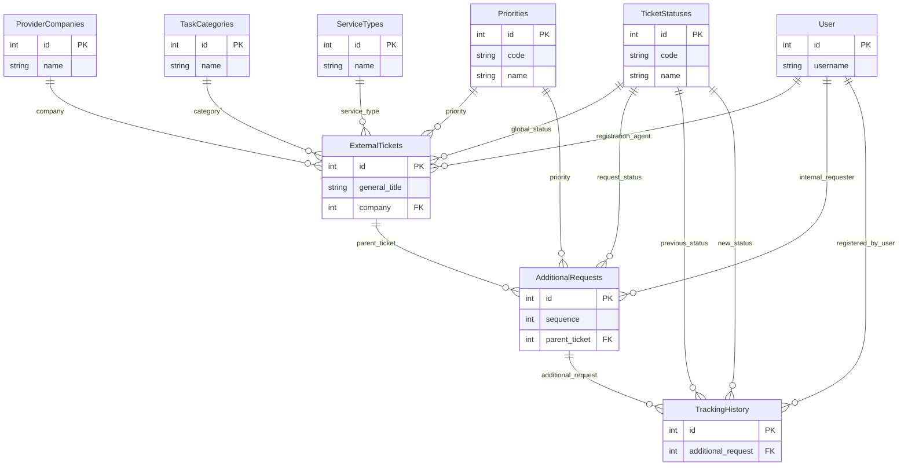

# Modelo de datos — Tickets

Documentación de las tablas (schemas OpenAPI) del dominio **ticket**, sus campos y relaciones.

**Fuente:** `openapi/swagger-v3.json` (schemas bajo `components.schemas`, tag `ticket`).  
**Base path API:** `/ticket/`

> En OpenAPI los FKs se exponen como `integer` (id). Las relaciones se inferen por nombre de campo y por el uso en el frontend (`src/features/tickets/types`).

---

## Diagrama de relaciones



---

## Resumen de recursos

| Tabla / Schema OpenAPI | Endpoint | Rol |
|---|---|---|
| `ExternalTickets` | `/ticket/ticket/` | Ticket externo (entidad principal) |
| `AdditionalRequests` | `/ticket/additional_request/` | Pedidos / requerimientos adicionales del ticket |
| `TrackingHistory` | `/ticket/tracking_history/` | Historial de seguimiento de un pedido adicional |
| `TicketStatuses` | `/ticket/ticket_status/` | Catálogo de estados |
| `Priorities` | `/ticket/priority/` | Catálogo de prioridades |
| `ProviderCompanies` | `/ticket/provider_company/` | Catálogo de empresas proveedoras |
| `ServiceTypes` | `/ticket/service_type/` | Catálogo de tipos de servicio |
| `TaskCategories` | `/ticket/task_category/` | Catálogo de categorías de tarea |

`User` no pertenece al módulo ticket; se referencia desde varios FKs (`registration_agent`, `internal_requester`, `registered_by_user`).

---

## 1. `ExternalTickets` — Ticket

Schema OpenAPI: `ExternalTickets`  
Endpoint: `/ticket/ticket/` · `/ticket/ticket/{id}/`

Ticket externo (principal del dominio). Agrupa datos de cabecera y apunta a catálogos vía FK.

### Campos

| Campo | Tipo | Nullable | Required | Read-only | Descripción |
|---|---|---|---|---|---|
| `id` | `integer` | No | — | Sí | Identificador |
| `external_ticket_number` | `string` (max 100) | Sí | No | No | Número de ticket en el sistema externo |
| `simple_action_number` | `string` (max 100) | Sí | No | No | Número de acción simple |
| `general_title` | `string` (max 500, min 1) | No | **Sí** | No | Título general |
| `description` | `string` | Sí | No | No | Descripción |
| `context` | `string` | Sí | No | No | Contexto |
| `direct_ticket_url` | `string` (max 500) | Sí | No | No | URL directa al ticket externo |
| `external_opening_date` | `date-time` | Sí | No | No | Fecha de apertura externa |
| `external_closing_date` | `date-time` | Sí | No | No | Fecha de cierre externa |
| `active` | `boolean` | No | No | No | Activo / inactivo |
| `createdat` | `date-time` | No | — | Sí | Fecha de creación |
| `updatedat` | `date-time` | No | — | Sí | Fecha de actualización |
| `category` | `integer` (FK) | Sí | No | No | → `TaskCategories.id` |
| `service_type` | `integer` (FK) | Sí | No | No | → `ServiceTypes.id` |
| `global_status` | `integer` (FK) | Sí | No | No | → `TicketStatuses.id` |
| `priority` | `integer` (FK) | Sí | No | No | → `Priorities.id` |
| `company` | `integer` (FK) | No | **Sí** | No | → `ProviderCompanies.id` |
| `registration_agent` | `integer` (FK) | Sí | No | No | → `User.id` (usuario que registró) |

### Relaciones

| Campo FK | Tabla destino | Cardinalidad | Notas |
|---|---|---|---|
| `company` | `ProviderCompanies` | N : 1 | Obligatoria |
| `category` | `TaskCategories` | N : 1 | Opcional |
| `service_type` | `ServiceTypes` | N : 1 | Opcional |
| `global_status` | `TicketStatuses` | N : 1 | Opcional |
| `priority` | `Priorities` | N : 1 | Opcional |
| `registration_agent` | `User` | N : 1 | Opcional |
| *(inversa)* | `AdditionalRequests` | 1 : N | Vía `AdditionalRequests.parent_ticket` |

---

## 2. `AdditionalRequests` — Pedido adicional

Schema OpenAPI: `AdditionalRequests`  
Endpoint: `/ticket/additional_request/` · `/ticket/additional_request/{id}/`

Requerimientos o pedidos asociados a un ticket padre. Cada uno puede tener su propio estado, prioridad e historial de seguimiento.

### Campos

| Campo | Tipo | Nullable | Required | Read-only | Descripción |
|---|---|---|---|---|---|
| `id` | `integer` | No | — | Sí | Identificador |
| `sequence` | `integer` | No | **Sí** | No | Orden / secuencia del pedido |
| `request_description` | `string` (min 1) | No | **Sí** | No | Descripción del pedido |
| `resolution_description` | `string` | Sí | No | No | Descripción de la resolución |
| `request_date` | `date-time` | Sí | No | No | Fecha del pedido |
| `completion_date` | `date-time` | Sí | No | No | Fecha de finalización |
| `active` | `boolean` | No | No | No | Activo / inactivo |
| `createdat` | `date-time` | No | — | Sí | Fecha de creación |
| `updatedat` | `date-time` | No | — | Sí | Fecha de actualización |
| `request_status` | `integer` (FK) | Sí | No | No | → `TicketStatuses.id` |
| `priority` | `integer` (FK) | Sí | No | No | → `Priorities.id` |
| `parent_ticket` | `integer` (FK) | No | **Sí** | No | → `ExternalTickets.id` |
| `internal_requester` | `integer` (FK) | Sí | No | No | → `User.id` (solicitante interno) |

### Relaciones

| Campo FK | Tabla destino | Cardinalidad | Notas |
|---|---|---|---|
| `parent_ticket` | `ExternalTickets` | N : 1 | Obligatoria |
| `request_status` | `TicketStatuses` | N : 1 | Opcional |
| `priority` | `Priorities` | N : 1 | Opcional |
| `internal_requester` | `User` | N : 1 | Opcional |
| *(inversa)* | `TrackingHistory` | 1 : N | Vía `TrackingHistory.additional_request` |

---

## 3. `TrackingHistory` — Historial de seguimiento

Schema OpenAPI: `TrackingHistory`  
Endpoint: `/ticket/tracking_history/` · `/ticket/tracking_history/{id}/`

Eventos de seguimiento vinculados a un pedido adicional (cambios de estado, comentarios, origen de la actualización).

### Campos

| Campo | Tipo | Nullable | Required | Read-only | Descripción |
|---|---|---|---|---|---|
| `id` | `integer` | No | — | Sí | Identificador |
| `event_date` | `date-time` | Sí | No | No | Fecha del evento |
| `update_source` | `string` (max 100) | Sí | No | No | Origen de la actualización |
| `comment` | `string` | Sí | No | No | Comentario |
| `active` | `boolean` | No | No | No | Activo / inactivo |
| `createdat` | `date-time` | No | — | Sí | Fecha de creación |
| `updatedat` | `date-time` | No | — | Sí | Fecha de actualización |
| `previous_status` | `integer` (FK) | Sí | No | No | → `TicketStatuses.id` |
| `new_status` | `integer` (FK) | Sí | No | No | → `TicketStatuses.id` |
| `additional_request` | `integer` (FK) | No | **Sí** | No | → `AdditionalRequests.id` |
| `registered_by_user` | `integer` (FK) | Sí | No | No | → `User.id` (usuario que registró) |

### Relaciones

| Campo FK | Tabla destino | Cardinalidad | Notas |
|---|---|---|---|
| `additional_request` | `AdditionalRequests` | N : 1 | Obligatoria |
| `previous_status` | `TicketStatuses` | N : 1 | Opcional |
| `new_status` | `TicketStatuses` | N : 1 | Opcional |
| `registered_by_user` | `User` | N : 1 | Opcional |

---

## 4. `TicketStatuses` — Estado de ticket

Schema OpenAPI: `TicketStatuses`  
Endpoint: `/ticket/ticket_status/` · `/ticket/ticket_status/{id}/`

Catálogo de estados reutilizado por tickets (`global_status`), pedidos adicionales (`request_status`) e historial (`previous_status` / `new_status`).

### Campos

| Campo | Tipo | Nullable | Required | Read-only | Descripción |
|---|---|---|---|---|---|
| `id` | `integer` | No | — | Sí | Identificador |
| `code` | `string` (max 50, min 1) | No | **Sí** | No | Código único del estado |
| `name` | `string` (max 100, min 1) | No | **Sí** | No | Nombre |
| `description` | `string` | Sí | No | No | Descripción |
| `active` | `boolean` | No | No | No | Activo / inactivo |
| `createdat` | `date-time` | No | — | Sí | Fecha de creación |
| `updatedat` | `date-time` | No | — | Sí | Fecha de actualización |

### Relaciones (inversas)

| Tabla origen | Campo FK | Cardinalidad |
|---|---|---|
| `ExternalTickets` | `global_status` | 1 : N |
| `AdditionalRequests` | `request_status` | 1 : N |
| `TrackingHistory` | `previous_status` | 1 : N |
| `TrackingHistory` | `new_status` | 1 : N |

---

## 5. `Priorities` — Prioridad

Schema OpenAPI: `Priorities`  
Endpoint: `/ticket/priority/` · `/ticket/priority/{id}/`

Catálogo de prioridades usado por tickets y pedidos adicionales.

### Campos

| Campo | Tipo | Nullable | Required | Read-only | Descripción |
|---|---|---|---|---|---|
| `id` | `integer` | No | — | Sí | Identificador |
| `name` | `string` (max 100, min 1) | No | **Sí** | No | Nombre |
| `code` | `string` (max 50, min 1) | No | **Sí** | No | Código |
| `active` | `boolean` | No | No | No | Activo / inactivo |
| `createdat` | `date-time` | No | — | Sí | Fecha de creación |
| `updatedat` | `date-time` | No | — | Sí | Fecha de actualización |

### Relaciones (inversas)

| Tabla origen | Campo FK | Cardinalidad |
|---|---|---|
| `ExternalTickets` | `priority` | 1 : N |
| `AdditionalRequests` | `priority` | 1 : N |

---

## 6. `ProviderCompanies` — Empresa proveedora

Schema OpenAPI: `ProviderCompanies`  
Endpoint: `/ticket/provider_company/` · `/ticket/provider_company/{id}/`

Catálogo de empresas / proveedores de soporte. Relación obligatoria con el ticket (`company`).

### Campos

| Campo | Tipo | Nullable | Required | Read-only | Descripción |
|---|---|---|---|---|---|
| `id` | `integer` | No | — | Sí | Identificador |
| `name` | `string` (max 255, min 1) | No | **Sí** | No | Nombre |
| `support_portal_url` | `string` (max 500) | Sí | No | No | URL del portal de soporte |
| `contact_name` | `string` (max 255) | Sí | No | No | Nombre de contacto |
| `contact_email` | `string` (max 255) | Sí | No | No | Email de contacto |
| `active` | `boolean` | No | No | No | Activo / inactivo |
| `createdat` | `date-time` | No | — | Sí | Fecha de creación |
| `updatedat` | `date-time` | No | — | Sí | Fecha de actualización |

### Relaciones (inversas)

| Tabla origen | Campo FK | Cardinalidad |
|---|---|---|
| `ExternalTickets` | `company` | 1 : N |

---

## 7. `ServiceTypes` — Tipo de servicio

Schema OpenAPI: `ServiceTypes`  
Endpoint: `/ticket/service_type/` · `/ticket/service_type/{id}/`

Catálogo simple de tipos de servicio.

### Campos

| Campo | Tipo | Nullable | Required | Read-only | Descripción |
|---|---|---|---|---|---|
| `id` | `integer` | No | — | Sí | Identificador |
| `name` | `string` (max 100, min 1) | No | **Sí** | No | Nombre |

### Relaciones (inversas)

| Tabla origen | Campo FK | Cardinalidad |
|---|---|---|
| `ExternalTickets` | `service_type` | 1 : N |

---

## 8. `TaskCategories` — Categoría de tarea

Schema OpenAPI: `TaskCategories`  
Endpoint: `/ticket/task_category/` · `/ticket/task_category/{id}/`

Catálogo simple de categorías de tarea (campo `category` del ticket).

### Campos

| Campo | Tipo | Nullable | Required | Read-only | Descripción |
|---|---|---|---|---|---|
| `id` | `integer` | No | — | Sí | Identificador |
| `name` | `string` (max 100, min 1) | No | **Sí** | No | Nombre |

### Relaciones (inversas)

| Tabla origen | Campo FK | Cardinalidad |
|---|---|---|
| `ExternalTickets` | `category` | 1 : N |

---

## Entidad externa referenciada: `User`

Schema OpenAPI: `User` (fuera del tag `ticket`; tipicamente `/auth` u usuarios del sistema).

| Campo | Tipo | Descripción |
|---|---|---|
| `id` | `integer` (read-only) | Identificador |
| `username` | `string` (max 150, required) | Nombre de usuario |
| `first_name` | `string` (max 150) | Nombre |
| `last_name` | `string` (max 150) | Apellido |

Referenciada por:

| Tabla | Campo FK |
|---|---|
| `ExternalTickets` | `registration_agent` |
| `AdditionalRequests` | `internal_requester` |
| `TrackingHistory` | `registered_by_user` |

---

## Jerarquía funcional

```
ProviderCompanies ──┐
TaskCategories ─────┤
ServiceTypes ───────┤
TicketStatuses ─────┼──► ExternalTickets (ticket)
Priorities ─────────┤         │
User ───────────────┘         │ parent_ticket
                              ▼
Priorities ─────────┐
TicketStatuses ─────┼──► AdditionalRequests (pedido adicional)
User ───────────────┘         │
                              │ additional_request
                              ▼
TicketStatuses ─────┐
User ───────────────┼──► TrackingHistory (evento de seguimiento)
```

1. Un **ticket** (`ExternalTickets`) pertenece a una empresa y opcionalmente tiene categoría, tipo de servicio, estado global y prioridad.
2. Un ticket tiene **N pedidos adicionales** (`AdditionalRequests`).
3. Cada pedido adicional tiene **N entradas de historial** (`TrackingHistory`) que registran cambios de estado y comentarios.

---

## Notas

- Los schemas OpenAPI no declaran `$ref` en los FKs: viajan como `integer`. Las tablas destino se documentan por convención del dominio y por el tipado del feature (`src/features/tickets/types/index.ts`).
- Campos comunes de auditoría en la mayoría de tablas: `active`, `createdat`, `updatedat` (`createdat` / `updatedat` son read-only).
- `ServiceTypes` y `TaskCategories` no incluyen `active` ni timestamps en la spec actual.
- Esta documentación debe regenerarse / revisarse si se actualiza `openapi/swagger-v3.json` con cambios en el dominio ticket.
)
